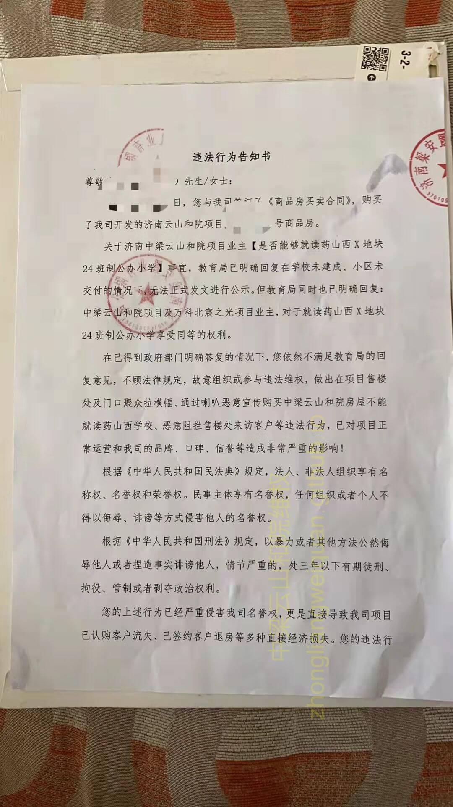
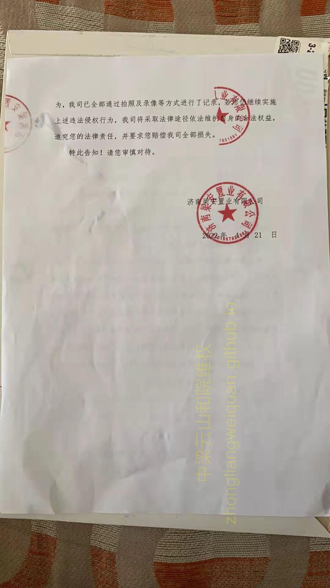

4月21日盖章的告知书，5月4日业主收到。。。。

内容如下：

违法行为告知书 

尊敬的 XXX 先生／女士：

日，您与我司订了《商品房买卖合同》，购买了我司开发的济南云山和院项目XXXXX号商品房。

关于济南中梁云山和院项目业主【是否能够就读药山西X地块24班制公办小学】事宜，教育局已明确回复在学校未建成、小区未交付的情况下，无法正式发文进行公示。但教育局同时也已明确回复：

中梁云山和院项目及万科北宸之光项目业主，对于就读药山西X地块24班制公办小学享受同等的权利。

在已得到政府部门明确答复的情况下，您依然不满足教育局的回复意见，不顾法律规定，故意组织或参与违法维权，做出在项目售楼处及门口聚众拉横幅、通过喇叭恶意宣传购买中梁云山和院房屋不能就读药山西学校、恶意阻拦售楼处来访客户等违法行为，已对项目正常运营和我司的品牌、口碑、信誉等造成非常严重的影响！

根据《中华人民共和国民法典》规定，法人、非法人组织享有名称权、名誉权和荣誉权。民事主体享有名誉权，任何组织或者个人不得以侮辱、诽谤等方式侵害他人的名誉权。

根据《中华人民共和国刑法》规定，以暴力或者其他方法公然侮辱他人或者捏造事实诽谤他人，情节严重的，处三年以下有期徒刑、拘役、管制或者剥夺政治权利。

您的上述行为已经严重侵害我司名誉权，更是直接导致我司项目已认购客户流失、已签约客户退房等多种直接经济损失。您的违法行为，我司已全部通过拍照及录像等方式进行了记录，若您仍继续实施

上述违法侵权行为，我司将采取法律途径依法维护自身的合法权益，追究您的法律责任，并要求您赔偿我司全部损失。

特此告知！请您审慎对待。

济南梁安置业有限公司 2022年 4月 21日 

对于业主维权，中梁有足够的应对经验，维权业主开会商议决定根据当前形势，对维权策略进行针对性调整，并对部分内容不再公示。