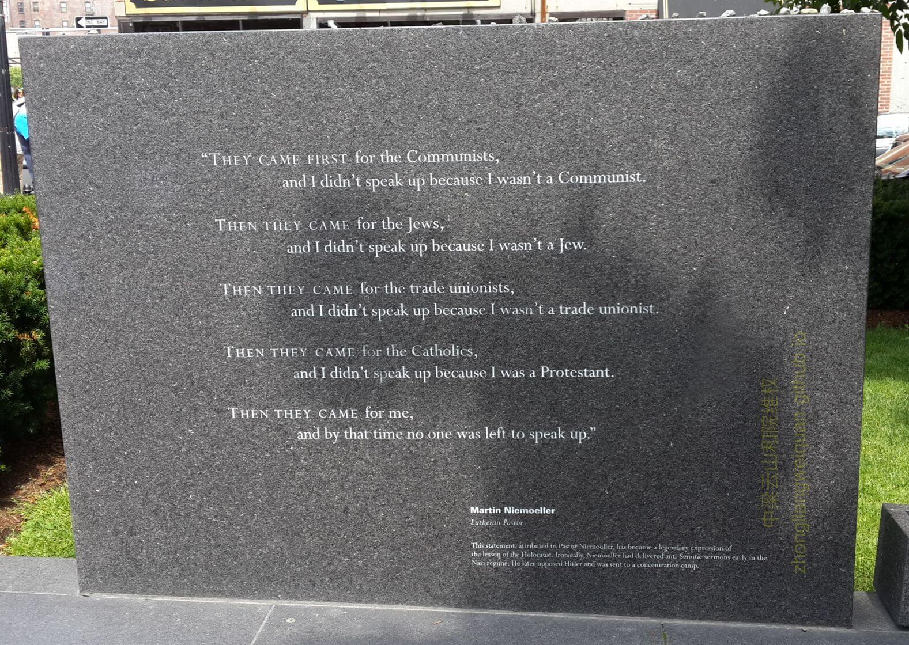

## 中文翻译

起初，纳粹抓共产党人的时候，
我沉默，因为我不是共产党人。

当他们抓社会民主主义者的时候，
我沉默，因为我不是社会民主主义者。

当他们抓工会成员的时候，
我沉默，因为我不是工会成员。

当他们抓犹太人的时候，
我沉默，因为我不是犹太人。

最后当他们来抓我时，
再也没有人站起来为我说话了。

## 1976原版

Als die Nazis die Kommunisten holten,
habe ich geschwiegen; ich war ja kein Kommunist.

Als sie die Sozialdemokraten einsperrten,
habe ich geschwiegen; ich war ja kein Sozialdemokrat.

Als sie die Gewerkschafter holten,
habe ich nicht protestiert; ich war ja kein Gewerkschafter.

Als sie die Juden holten,
habe ich geschwiegen; ich war ja kein Jude.

Als sie mich holten,
gab es keinen mehr, der protestieren konnte.

## 新英格兰犹太人大屠杀纪念碑

THEY CAME FIRST for the Communists,
and I didn't speak up because I wasn't a Communist.

THEN THEY CAME for the Jews,
and I didn't speak up because I wasn't a Jew.

THEN THEY CAME for the trade unionists,
and I didn't speak up because I wasn't a trade unionist.

THEN THEY CAME for the Catholics,
and I didn't speak up because I was a Protestant.

THEN THEY CAME for me,
and by that time no one was left to speak up.

## Introduction

"First they came …" is the poetic form of a 1946 post-war confessional prose by the German Lutheran pastor Martin Niemöller (1892–1984). It is about the silence of German intellectuals and certain clergy—including, by his own admission, Niemöller himself—following the Nazis' rise to power and subsequent incremental purging of their chosen targets, group after group. Many variations and adaptations in the spirit of the original have been published in the English language. It deals with themes of persecution, guilt, repentance, and personal responsibility.

## Author

Martin Niemöller was a German Lutheran pastor and theologian born in Lippstadt, Germany, in 1892. Niemöller was an anti-Communist and supported Adolf Hitler's rise to power. But when, after he came to power, Hitler insisted on the supremacy of the state over religion, Niemöller became disillusioned. He became the leader of a group of German clergymen opposed to Hitler. In 1937 he was arrested and eventually confined in Sachsenhausen and Dachau. He was released in 1945 by the Allies. He continued his career in Germany as a clergyman and as a leading voice of penance and reconciliation for the German people after World War II.